# The Book Zone

https://thebookzone.herokuapp.com//

Welcome to the site and I hope you enjoy it. I created this site as a follow-on from my previous milestone project at https://ms3-community-books.herokuapp.com//

I decided to keep the same theme as I believe the idea was sound but the implimentation from Flask was restrictive. Using Django I was able to achieve a much fuller
experience for users and really expand on the idea I initially had.
 
## UX
 
I created the initial project as a place for people to share book recommendations between each other. Giving users full access to add, edit and delete entries as they see fit.

With this project I decided that a better experience for users would involve having their own profiles and being able to add these books in multiple formats to their shopping
cart and also being able to checkout and make purchases with confirmation emails.

I believe the experience is also improved using toasts that inform the user when something is added, removed or updated in their cart.

The site is fully responsive down to the smallest screen size of 320px.

## wireframes

All wireframes were made using Balsamiq.

    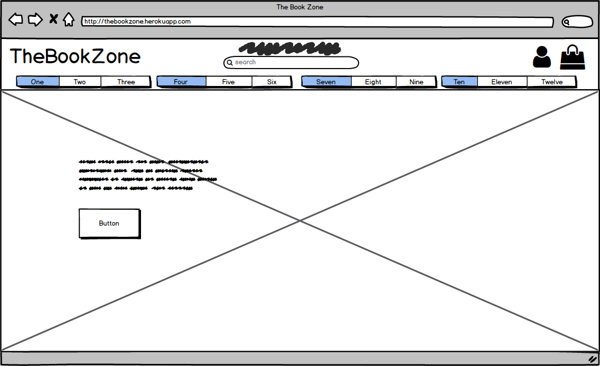

    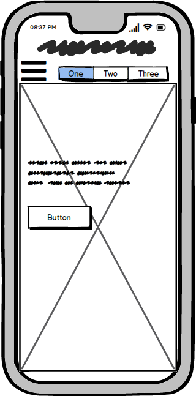

    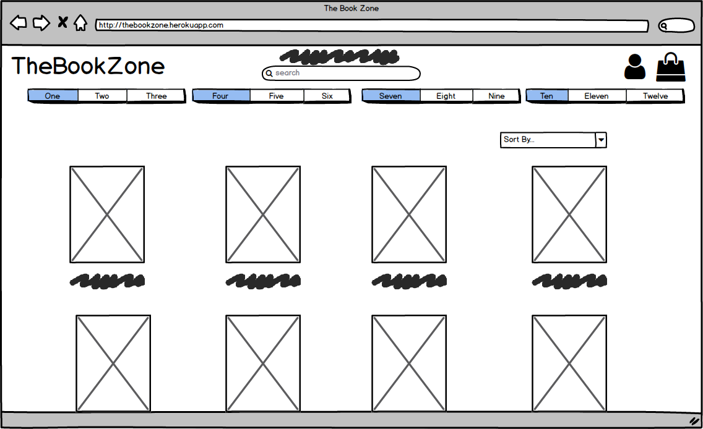

    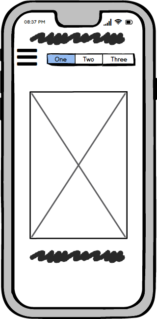

    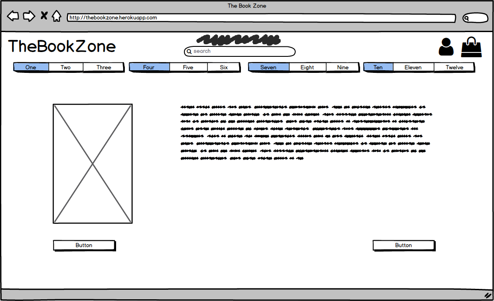

    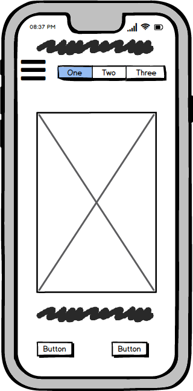

    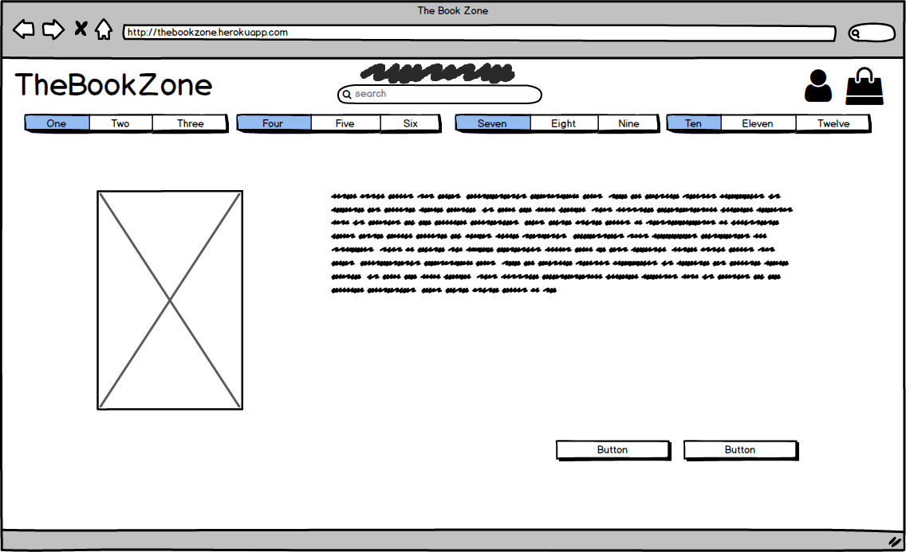

    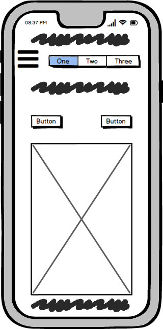

    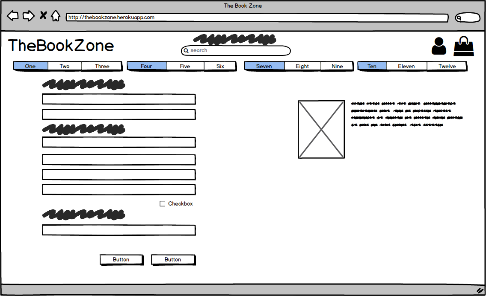

    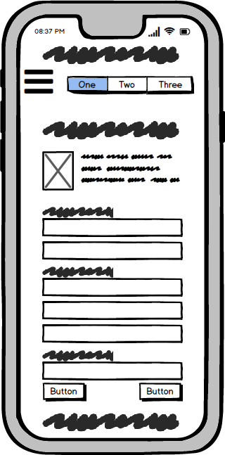

    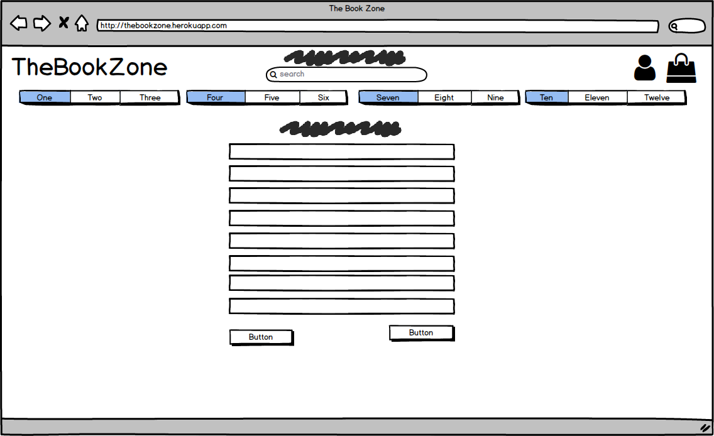

    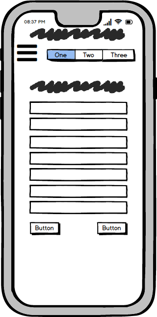

## User Stories

# As a shopper

— As a shopper I want to be able to view a list of books so that I can select some to purchase.

— As a shopper I want to be able to view individual book details so that I can identify the price, description, rating, image and available formats.

— As a shopper I want to be able to easily view the total of my purchases at any time so that I can avoid spending too much.

# Registration and accounts
  
— As a site user I want to be able easily register for an account to so that I can have a personal account and be able to view my profile.

— As a site user I want to be able easily login or logout to so that I can access my personal account information.

— As a site user I want to be able easily recover my password incase I forget it to so that I can recover access to my account.

— As a site user I want to be able receive an email confirmation after registration to so that I can verify that my account registration was successful.

— As a site user I want to be able have a personalized user profile to so that I can view my personal order history and order confirmations and save my payment information.

# Sorting and searching

- As a shopper I want to be able to sort the list of available books so that I can easily identify the best rated, best priced and categorically sorted books.

- As a shopper I want to be able to sort a specific category of book so that I can find the best priced or best rated book in a specific category, or sort the books in that category by title.

- As a shopper I want to be able to sort multiple categories of products simultaneously so that I can find the best priced or best rated books across broad categories, such as "Crime" or "Adventure"

- As a shopper I want to be able to search for a product by name or description so that I can find a specific book I'd like to purchase.

- As a shopper I want to be able to easily see what I've searched for and the number of results so that I can quickly decide whether or not the book I want is available.

# Purchasing and checkout 

- As a shopper I want to be able to easily select the format and quantity of a book when purchasing it so that I can ensure I dont accidentally select the wrong book, quantity or format.

- As a shopper I want to be able to view items in my cart to be purchased so that I can identify the total cost of my purchase and all items I will receive.

- As a shopper I want to be able to adjust the quantity of individual items in my cart so that I can easily make changes to my purchase before checkout.

- As a shopper I want to be able to easily enter my payment information so that I can checkout quickly and with no hassle.

- As a shopper I want to be able to feel my personal and payment information is safe and secure so that I can confidently provide the needed information to make a purchase.

## Features

# Books

In the books app I have 4 templates 2 of which are available to users and 2 reserved for admins.

- The books.html page extends the base template and displays a full catalog of all books in the database. Each book has an image, image url, price,
rating and a link for the genre to display books specifically in that category. This page includes a horizontal rule which is resposive across all 
browsers and ensures the site is layed out properly no matter how the user accesses it. The page also includes a convenient back to top button to
make it more convenient for the user to jump back to the top of the page without having to scroll manually.

- The book_detail.html page extends the base template and displays the detail for a specific book in the database. It displays the book cover on the
left and on the right it displays the price of the book, the genre as a link to view more of the same category, the rating, description, format selector
box, quantity selector and 2 buttons which allow a use to either return to books.html or add the book to their cart which will trigger a toast informing 
them that the book is now in their cart. The quantity selector box is also validated so a user cannot enter an invalid value as a quantity.

- The add book and edit book templates extend the base template. The edit book template will auto populate with the existing book information, allowing 
admin users to edit any field on the book. The add book template will give users the option to add a new book with all the relevant fields and add a 
default image should the admin not choose or forget to add a cover art to the book.

# Cart

In the cart app I have 6 templates. I use includes to manage the layout and create a responsive design on mobile devices.

- The cart.html page includes information on each book that's been added to the cart, including the image, title, the format the user has selected,
both ISBN numbers, the price and the subtotal for each item. In between the price and the subtotal there is a quantity selector box with full
validation and 2 buttons, one to update to the desired quantity and the other to remove the item from the cart. This has also been made so that if two 
books of different formats are added to the cart, only the one the user selects will be removed. Below this information there is  a cart total, a 
delivery charge which is calculated at 10% of the cost and the grand total. There is also a message informing the user that should they spend x amount
more they will receive free delivery. There is then 2 buttons, one to continue shopping and another to checkout securely.

# Checkout

The checkout app has 2 templates, the first is for the checkout page and the second is for a checkout success page.

- The checkout page extends the base template and has 2 columns. The first column includes a fully validated form with a country selector. It also has
a checkbox to save their information to their profile if they are logged in or alternatively if the user is not signed in it will give them the option
to register as a new user or login with an existing account. A returning user will also have these fields auto populated should they have chosen to save
their information on a previous purchase. Below this there is a stripe card element with full validation and 2 buttons. One to return to their cart and 
another to complete the payment. 

The second column details information for each item being purchased such as the book image, name, format, quantity and subtotal for each line item. With an
order total, delivery cost and grand total.

# Home

The home app extends the base template and has a simple landing page with a link to view all books in the library and a welcome banner. It is laid on an image
sourced from google images.

# Profiles

The profile app extends the base template and has 2 columns. The first has default delivery information which is auto populated if the user has chosen to save
their information on a previous purchase. Below this there is a button for updating the users information if they have changed any details. 

The second column has a list of orders the user has made with information on their truncated order number, order date and time, what they purchased and the 
order total.

The proiles app is also fully functional should a user wish to reset their password and will send them an email with a password reset link.

If the user is an admin they will have an extra option in the account menu dropdown to add a new book to the library. This will open a new form requiring all
the information needed for a book in the database.

# Main Nav

The main nav uses two rows. The first row includes the name of the site which links back to the home page, a search bar, and two buttons, the first for the profile and
the second for the shopping cart which displays the current total of items in the cart.

The second row has a main button which triggers a dropdown for sorting by price, category and rating. It has 11 other buttons, 10 for each genre and 1 other to display all
books.

# Mobile Header

The mobile header is split into 4 buttons, the main toggler, search bar, the account dropdown and the shopping cart. 

The main toggler displays a dropdown menu with a link to the home page, an internal dropdown menu with sorting, and the other 11 buttons, 10 for each genre and 1 to display
all books in the library.

### Features Left to Implement

— In future development the two main things left to implement to make this a working site to take real payments from stripe and having a system to track inventory.

## Technologies Used

— [JQuery](https://jquery.com)
 — The project uses **JQuery** to support some design and functionality.

— [Bootstrap](https://https://getbootstrap.com/)
 — The project uses **Bootstrap** to simplify the design process.
    
— [Django](https://https://www.djangoproject.com/)
 — Django was used to create my application.

## Testing

1. Books App
 — I tested all buttons to make sure everything is linked correctly.
 — I ensured all books are displaying from the database with the correct information.
 — I tested the edit and delete functionality on multiple books then ensured that this information was reflected
 in the admin before changing them back to the original information.
 — I tested the genre tags to ensure that the categories displayed when one is clicked are correct.
 — I tested the sort and search parameters to make sure they sorting works correctly and that the search criteria displays
 results matched with the name or the description.
 — I tested the default image to ensure that if an entry does not have an image it will display a default one for the user.
 

2. Cart App
 — I tested all buttons to make sure everything is linked correctly. 
 — I tested the responsive design of all forms and elements to the smallest mobile devices of 320px.
 — I tested the bag by clicking on it without any items which displays a default message letting the user know that there
 is nothing in their cart.
 — Once I added a book I ensured all relevant information was being diaplyed correctly.
 — I tested the quantity selector box to ensure proper valitation if the user goes outside the desired range.
 —  I tested the update and remove buttons to ensure initial functionality. I also made sure that should have a book with multiple
 formats that only the desired format is affected.
 — I tested the prices of delivery and the free shipping banner in the shopping cart by changing the claculations to reflect this.

 3. Checkout App
  — I tested all buttons to make sure everything is linked correctly.
  — I tested the responsive design of all forms and elements to the smallest mobile devices of 320px.
  — I tested all form validation to ensure all required fields would trigger a message to let the user know that the field is required.
  — I tested the card element to make sure that the form was validating correctly and also displaying the correct messages if the card
  information entered is incorrect or incomplete.
  — I tested my webhooks and webhook handlers by leaving the page early and clicking the submit button multiple times. I did this to verify
  that the webhook still created the payment intent with stripe. This ensures that the users order will still go through and they will not
  be charged without us receiving their order.

  4. Home App
  — I tested that the main button on the home page works.
  — I tested that the image, banner and button elements were responsive on the smallest mobile devices of 320px.

  5. Media
  — I tested that all images in the media folder were displaying correctly and corresponded to the correct entry in the database.
  — I tested that the noimage.png file was automatically being assigned to entries that do not have an image uploaded.

  6. Profiles
  — I tested that all links to the profile page and related pages worked correctly.
  — I tested that the password reset link works by clicking forgot password and entering an email. I then received and email with a
  link to reset my password, completed the form and submitted it. I then signed in with my new password.
  — I tested the registration form by entering a temporary email. I received the email and clicked the link to register. I also checked
  this in the admin to ensure the validated and primary boxes were ticked once the emails were vaildated.

## Deployment

I used Heroku to deploy my site using the following steps.

1. Create a requirements.txt file.
2. Create a Procfile. (Case sensitive)
3. Create a new app with Heroku.
4. Add IP and PORT config variables to Heroku.
5. Push my code to Heroku.
6. In Heroku I made use of multiple environment variables to ensure functionality of AWS, Stripe, Gmail and Postgres.

This site can also be deployed by selecting the 'Clone' option from the below GitHub repository.

https://github.com/DalyAD/TheBookZone

### Content
— The majority of the layout was modeled from the Boutique Ado project. I changed the color pallette and the positioning of form elements with a single
column so they sit in the middle of the page on larger screen sizes.

### Media
— The background image I used was found using Google images.
- The images and json data for books and categories were sources from Kaggle and edited to suit the purpose of the site.